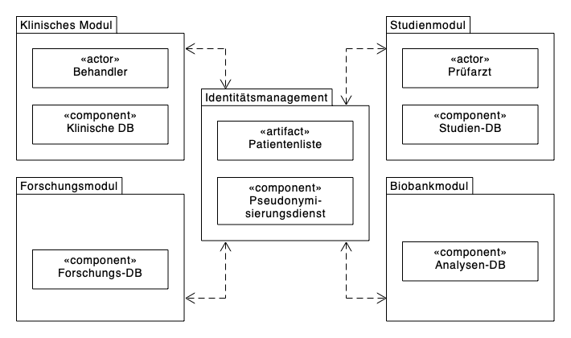
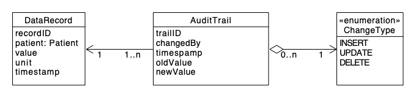

# Der Umgang mit Gesundheitsdaten

Die Datenschutzgrundverordnung (DSGVO) definiert 
Gesundheitsdaten als *"personenbezogene Daten, die sich auf die körperliche oder geistige Gesundheit einer natürlichen Person, einschließlich der Erbringung von Gesundheitsdienstleistungen, beziehen und aus denen Informationen über deren Gesundheitszustand hervorgehen"* (§ 46 Abs. 13 DSGVO). Sie gelten als besonders sensibel. Beispielswise erlaubt [Art. 9 DSGVO](https://dsgvo-gesetz.de/art-9-dsgvo/) deren Verarbeitung nur in ausgewählten Fällen. Die Dokumentation solcher Daten ist dabei genauso wichtig wie die Daten selbst. Dadurch ergeben sich besondere Anforderungen an die Handhabung von Gesundheitsdaten in der Forschung:

- Zentrale Bedeutung von Datenschutz und Ethik

- Anonymisierung und Pseudonymisierung

- Kontrollierter Zugriff und Verteilung

- Verwendung standardisierter Terminologien

- Interoperabilität

- Versionierung und Nachvollziehbarkeit

- Dokumentation der Datenerhebung und der einzelnen Verarbeitungsschritte

Als Ideal kann die Faustregel "So offen wie möglich, so geschlossen wir nötig" gesehen werden.

::: {.callout-note}
Als Dach­organisation der medizinischen Ver­bundforschung in Deutschland stellt die TMF e.V. in ihrer Schriftenreihe diverse Konzepte, Leitfäden und Rechtsgutachten zum Umgang mit Gesundheitsdaten bereit. Die [Bände der TMF-Schriften­reihe](https://www.tmf-ev.de/publikationen/tmf-schriftenreihe) sind als Open-Access-Versionen frei verfügbar.
:::

::: {.callout-note}
In @sec-appendix-dmp-health finden Sie das Beispiel eines Datenmanagementplans speziell für für deutschsprachige Gesundheitsprojekte in einfachem [Markdown-Textormat](https://www.markdownguide.org/basic-syntax/).
:::

## Datenschutz und Ethik

Vor dem Projektstart sollte geklärt werden:

1. Liegt ein [Ethikvotum](https://uol.de/medizinische-ethikkommission/formulare) vor?^[Wann ist ein Ethikvotum überhaupt notwendig? Der Arbeitskreis Medizinischer Ethik-Kommissionen in der Bundesrepublik Deutschland e.V. stellt eine übersichtliche Entscheidungshilfe parat, siehe [https://www.akek.de/einreichung-von-forschungsvorhaben/](https://www.akek.de/einreichung-von-forschungsvorhaben/)]

2. Gibt es eine informierte Einwilligung (engl. *informed consent*)

3. Welche Art der Verarbeitung und Datennachnutzung umfasst die informierte Einwilligung?^[Siehe z. B. [https://www.pedocs.de/volltexte/2022/22301/pdf/fdb-info_4_Formulierungsbeispiele_fuer_informierte_Einwilligungen_2018_v2.1_A.pdf](https://www.pedocs.de/volltexte/2022/22301/pdf/fdb-info_4_Formulierungsbeispiele_fuer_informierte_Einwilligungen_2018_v2.1_A.pdf)]

::: {.callout-note}
Der [Arbeitskreis Medizinischer Ethik-Kommissionen in der Bundesrepublik Deutschland e.V.](https://www.akek.de) stellt diverse Mustertexte und [Richtlinien](https://www.akek.de/richtlinien/) zur Verfügung.
:::


::: {.callout-note}
In @sec-appendix-ic finden Sie das Beispiel einer informierten Einwilligung in einfachem [Markdown-Textormat](https://www.markdownguide.org/basic-syntax/).
:::

## Anonymisierung und Pseudonymisierung

Die [Begrifssbestimmungen in Art. 4 DSGVO](https://dsgvo-gesetz.de/art-4-dsgvo/) definieren Pseudonymisierung als *"[...] die Verarbeitung personenbezogener Daten in einer Weise, dass die personenbezogenen Daten ohne Hinzuziehung zusätzlicher Informationen nicht mehr einer spezifischen betroffenen Person zugeordnet werden können, sofern diese zusätzlichen Informationen gesondert aufbewahrt werden und technischen und organisatorischen Maßnahmen unterliegen, die gewährleisten, dass die personenbezogenen Daten nicht einer identifizierten oder identifizierbaren natürlichen Person zugewiesen werden"*. [§ 46 Abs. 5 Bundesdatenschutzgesetz (BDSG)](https://dsgvo-gesetz.de/bdsg/46-bdsg/) bestimmt Pseudonymisierung sehr ähnlich.


Gemäß [§ 3 (6) BDSG a. F.](https://dejure.org/gesetze/BDSG_a.F./3.html)^[In der Fassung der Bekanntmachung vom 14.01.2003 (BGBl. I S. 66), zuletzt geändert durch Gesetz vom 30.10.2017 (BGBl. I S. 3618) m.W.v. 09.11.2017, Außer Kraft getreten am 25.05.2018 aufgrund Gesetzes vom 30.06.2017 (BGBl. I S. 2097), siehe [https://dejure.org/gesetze/BDSG_a.F.](https://dejure.org/gesetze/BDSG_a.F.)] ist Anonymisierung *"[...] das Verändern personenbezogener Daten derart, dass die Einzelangaben über persönliche oder sachliche Verhältnisse nicht mehr oder nur mit einem unverhältnismäßig großen Aufwand an Zeit, Kosten und Arbeitskraft einer bestimmten oder bestimmbaren natürlichen Person zugeordnet werden können"*.

Für Gesundheitsdaten wird daher allgemein empfohlen:

- Entfernen direkter Identifikatoren (Name, Adresse etc.) oder Ersetzen durch Pseudonyme

- Besondere Berücksichtigung indirekter Identifikatoren (Alter, seltene Krankheit etc.)^[Die Angaben von Alter und seltener Krankheit kann die Reidentifizierung einzelner Personen ermöglichen.]

Für die konkrete Forschung mit Patienten oder Probanden ergibt sich der Bedarf, personenidentifizierende Daten von den Forschungsdaten separat zu verwalten und auf Verlangen der Probanden (z. B. bei Löschanfragen) wieder zusammen führen zu können. 

{#fig-tmf-datenschutzkonzept width=75%}

::: {.callout-note}
In ihrem [Leitfaden zum Datenschutz in medizinischen Forschungsprojekten](https://www.tmf-ev.de/publikationen/tmf-schriftenreihe/leitfaden-zum-datenschutz-in-medizinischen-forschungsprojekten) stellt die TMF e.V. ein modularisiertes Datenschutzkonzept für den Forschungskontext bereit, siehe @pommerening_leitfaden_2014 und @fig-tmf-datenschutzkonzept. Zentrale Komponente ist dabei der Pseudonymisierungsdienst des Identitätsmanagement-Moduls. Ein Beilspiel eines solchen Dienstes findet sich in @puchkovskiy_service-basiertes_2015.
:::

## Kontrollierter Zugriff und Verteilung

Offene Repositories wie [GitHub](https://github.com) und [Zenodo](https://zenodo.org) sind in der Regeln nicht geeignet für die Speicherung von Rohdaten. 

**Empfehlung:** Stattdessen können Sie den Datenzugang wie folgt realisieren:

- Metadaten offen zugänglich machen

- Die eigentlichen Forschungsrohdaten kontrolliert zugänglich machen

    - Auf separatem Antrag hin: Data Use Agreement (DUA)^[Siehe z. B. [https://www.gesis.org/fileadmin/upload/dienstleistung/daten/secure_data_center/GESIS_Data_Use_Agreement_Off-Site.pdf](https://www.gesis.org/fileadmin/upload/dienstleistung/daten/secure_data_center/GESIS_Data_Use_Agreement_Off-Site.pdf)]

    - An definierter Kontaktstelle richtend

::: {.callout-note}
In @sec-appendix-dua finden Sie das Beispiel eines Data Use Agreement in einfachem [Markdown-Textormat](https://www.markdownguide.org/basic-syntax/).
:::

## Verwendung standardisierter Terminologien

Die Verwendung einheitlicher Begriffe eröht die Nachnutzbarkeit von Daten. Im Bereich Gesundheit gibt es definierte Standards, z. B.

- [ICD-10](https://www.bfarm.de/DE/Kodiersysteme/Klassifikationen/ICD/ICD-10-GM/_node.html) (zur Codierung von Diagnosen)

- [SNOMED CT](https://docs.snomed.org/snomed-ct-practical-guides/snomed-ct-starter-guide) (zur Codierung klinischer Begriffe)

**Empfehlung:** Dokumentieren Sie die Abbildung projektspezifischer Begriffe auf etablierte Terminologien in einer Mapping-Tabelle, sofern nötig.

## Interoperabilität

Der Austausch von Daten zwischen verschiedenen Systemen erfordert Interoperabilität. Vermeiden Sie proprietäre Formate wie Microsoft Excel-Dateien mit undokumentierter Tabellenstruktur.

**Empfehlung:** Nutzen Sie auch hier etablierte Formate wie z. B. [HL7 FHIR](https://www.hl7.org/fhir/).

## Versionierung und Nachvollziehbarkeit

Repositories wie [GitHub](https://github.com) zur Versionierung und [Zenodo](https://zenodo.org) zur Datenveröffentlichung können Sie nicht für sensible Daten verwenden wohl aber für begleitende Datensätze:

- Ausführbare Skripte

- Dokumentation der Datenverarbeitungsschritte

**Empfehlung:** Verwenden Sie zur Versionierung der Datenbestände zusätzlich zu *Semantic Versioning* in @sec-semver logische Zusätze zur Beschaffenheit der Daten, z. B. `v1.1.3-cleaned`. Mögliche Zusätze sind:

- `-raw` für Rohdaten

- `-cleaned` für bereinigte oder aufbereitete Datenbestände

- `-analysed` für untersuchte oder um Analyseergebnisse ergänzte Datenbestände

Reine Ergänzungen sollten dabei weiterhin nur die `MINOR`-Nummer der Versionsnummer erhöhen, grundlegende strukturelle Änderungen (z. B. neue Variablenstruktur, neue Datensätze) die  `MAJOR`-Nummer.

## Dokumentation der Datenerhebung und der einzelnen Verarbeitungsschritte

Gegebenenfalls muss jede Änderung einer Variable bei der Datenerhebung dokumentiert werden, was den Aufwand zur Datenpflege und den Speicherbedarf schnell erhöht, siehe @fig-audit-trail.

{#fig-audit-trail width=75%}

Ebenfalls kann es notwendig werden, die Bedeutung der erhobenen Variablen in einem Codebuch zu dokumentieren, damit Rohdaten zu einem späteren Zeitpunkt und durch Dritte interpretiert werden können. Dazu gehören:

- Variablenbeschreibung: Name der Variable, Maßeinheit, Bedeutung
  
- Kodierung: Kodierung der Variablen z. B. 
  
    ```
    0: Weiblich
    1: Männlich
    2: Divers
    3: Ohne Angabe
    ```

**Empfehlung:** Klären Sie die Notwendigkeit zur Pflege einer Änderungshistorie und eines Codebuchs vor Projektbeginn.
